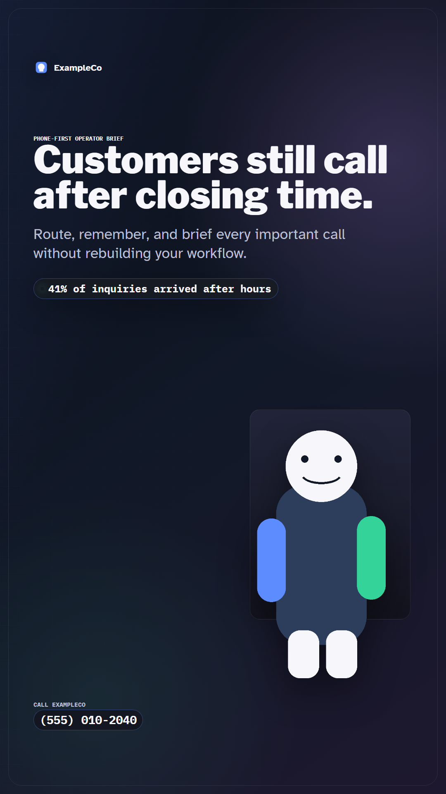
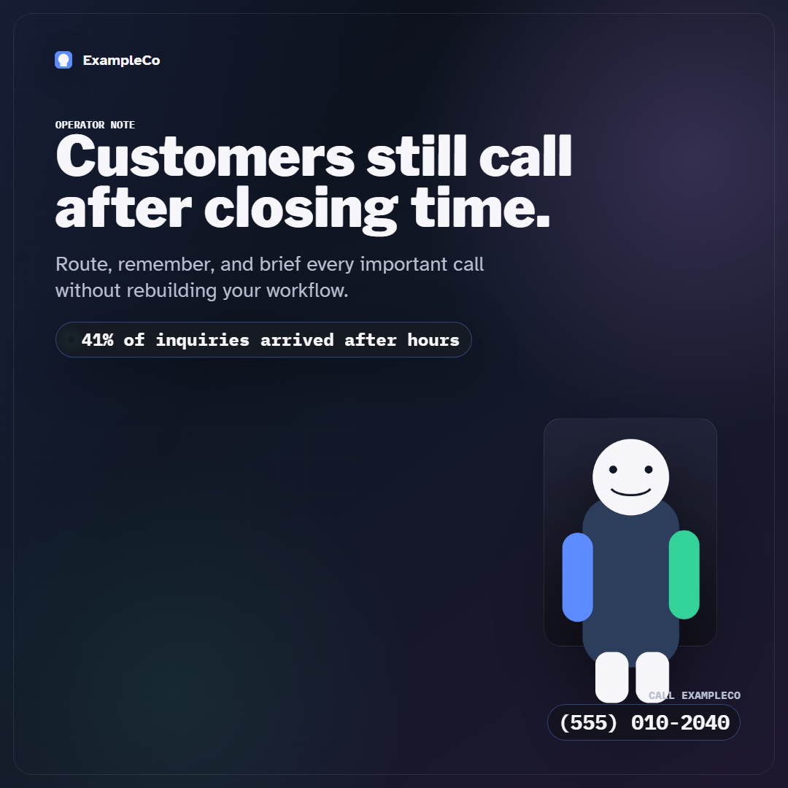
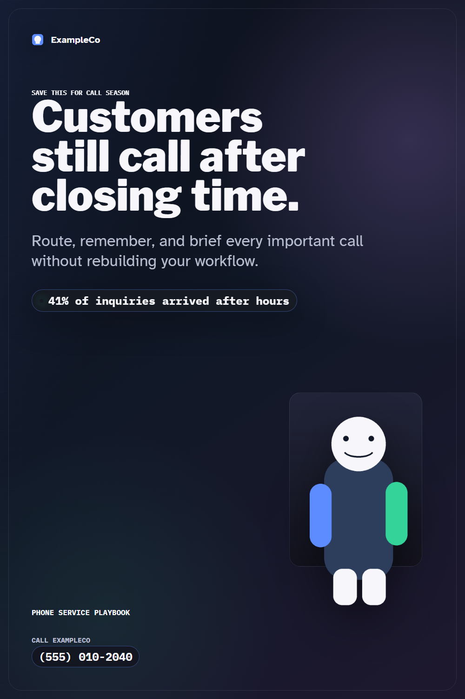
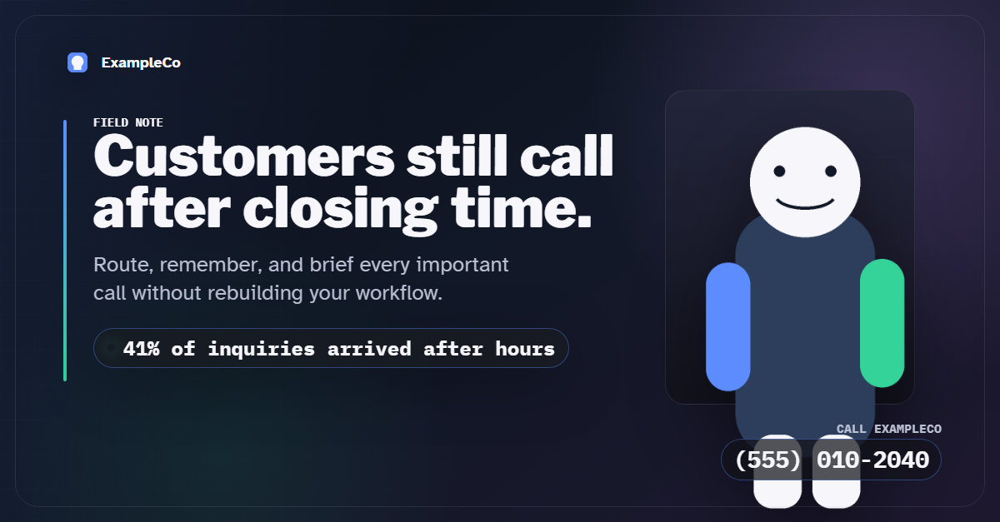
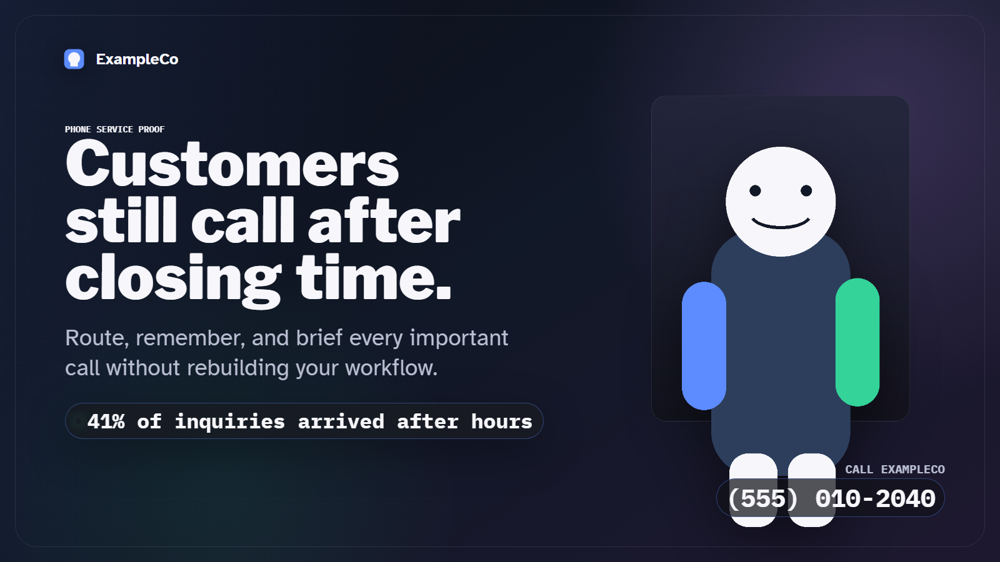
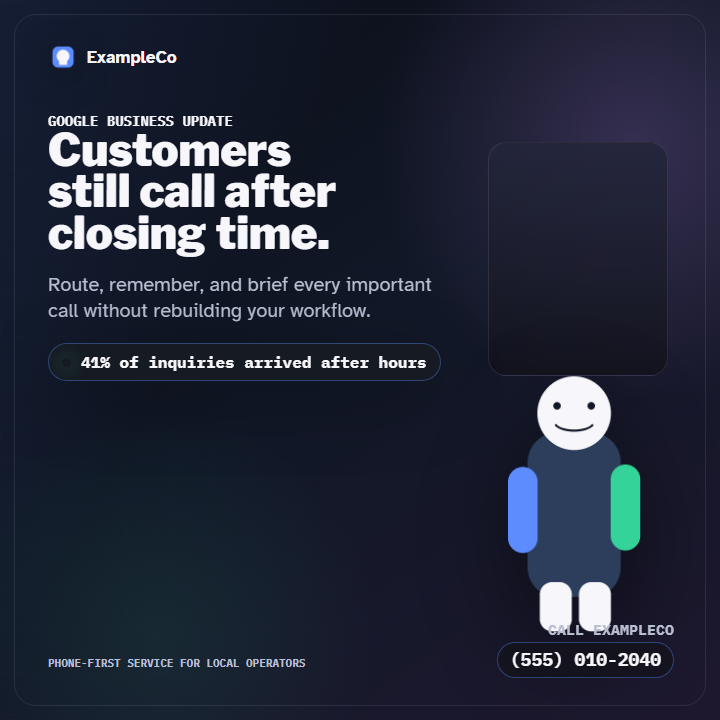

# Visual Factory Kit

Create once. Ship everywhere.

Visual Factory Kit is a deterministic image factory for marketing teams that need branded creative across every major platform without redesigning the same asset twenty different ways.

Give it a JSON request and a brand pack. It renders platform-ready PNGs for social posts, ads, thumbnails, Google Business Profile posts, Pinterest pins, carousels, Reels, Stories, OG cards, and blog headers. Every output gets a provenance file and a QA report.

No generic AI imagery. No mystery Canva resizing. No "it looked fine on my screen" creative handoff.

## Example Outputs

These are generated from the included sample request and example brand pack.

| Instagram Reel | Facebook Feed | Pinterest Pin |
|---|---|---|
|  |  |  |

| LinkedIn Article Hero | X Landscape Post | Google Business Profile |
|---|---|---|
|  |  |  |

The sample QA report is here:

```text
examples/outputs/example-after-hours-qa-report.json
```

## Why Marketers Use This

Most teams do not have a content problem. They have a production consistency problem.

One article, launch, offer, webinar, case study, or local promotion usually needs:

- LinkedIn image
- Facebook image
- Instagram square
- Instagram portrait
- Reel or Story cover
- Pinterest pin
- X image
- YouTube thumbnail
- Google Business Profile post
- OG card
- Blog header
- Ad variants
- Carousel slides

That work gets slow when every size is rebuilt by hand. It gets risky when brand, proof, alt text, and calls to action drift across channels.

Visual Factory Kit turns the creative into a repeatable system:

- Put the message in one request file.
- Put the brand in one brand pack.
- Render every format from a platform matrix.
- Check QA before anything ships.

## What It Makes

The platform matrix includes formats for:

- LinkedIn article images, feed images, ads, and carousels
- Facebook feed, cover, Story, Reel, and ad images
- Instagram feed, Story, Reel, and carousel images
- Meta ad square, portrait, landscape, and Story/Reel images
- X posts, ads, and headers
- Threads square and portrait images
- TikTok vertical feed images
- YouTube thumbnails and Shorts covers
- Pinterest pins, square pins, and board covers
- Google Business Profile square and wide posts
- Google Display landscape and square ads
- Blog headers and OG cards

See the full list in:

```text
visual_factory/platform-size-matrix.json
```

## How It Works

Visual Factory Kit has three moving parts.

1. A visual request JSON

This contains the campaign message:

- headline
- subhead
- proof label
- proof source
- CTA
- phone number
- alt text
- output folder
- format list

Start with:

```text
examples/sample-request.json
```

2. A brand pack

This contains the brand system:

```text
brand-packs/example/
├── brand.json
├── tokens.css
└── assets/
    ├── icon.png
    └── mascot.png
```

Create your own brand pack by copying `brand-packs/example`, replacing the transparent PNG assets, and editing `brand.json` and `tokens.css`.

3. Deterministic templates

Templates live in:

```text
visual_factory/templates/
```

They are HTML/CSS templates rendered through Playwright. Important text blocks are measured in-browser and shrink-to-fit before screenshots are saved.

## Quick Start

Install dependencies:

```powershell
pip install -r requirements.txt
python -m playwright install chromium
```

Render the included example:

```powershell
python visual_factory\render.py render --request examples\sample-request.json --brand brand-packs\example
```

Open the output folder:

```text
examples/outputs/
```

Use the images only when the QA report says:

```json
"passed": true
```

## Request Example

```json
{
  "client": "ExampleCo",
  "formats": [
    "linkedin_article_hero",
    "instagram_reel",
    "facebook_feed_square",
    "pinterest_pin",
    "google_business_post"
  ],
  "message": {
    "headline": "Customers still call after closing time.",
    "subhead": "Route, remember, and brief every important call without rebuilding your workflow.",
    "proof_label": "41% of inquiries arrived after hours",
    "cta": "Call ExampleCo",
    "phone_number": "(555) 010-2040"
  },
  "output": {
    "alt_text": "ExampleCo social graphic about customers calling after closing time.",
    "destination_dir": "examples/outputs",
    "filename_prefix": "example-after-hours"
  }
}
```

The full schema is here:

```text
visual_factory/schemas/visual-request.schema.json
```

## QA Checks

Every render writes:

- a PNG
- a `.provenance.json` sidecar
- a request-level QA report

The QA report checks:

- exact platform dimensions
- text overflow
- mobile preview readability
- required alt text
- proof source presence
- provenance sidecar presence
- banned public-facing terms

This is useful for teams that care about claims, attribution, accessibility, and brand consistency.

## Provenance

Every image gets a sidecar file that records:

- request ID
- content ID
- template
- dimensions
- brand assets used
- font stack
- proof source
- render timestamp
- AI assistance notes
- approval status

This makes the system easier to audit later. It also helps creative teams remember where a claim, asset, or template came from.

## Brand Pack Tips

Good brand packs include:

- a transparent logo or icon
- a transparent product, mascot, or brand visual
- real brand colors in `tokens.css`
- a default phone number or CTA only if useful
- enough contrast for small mobile previews

Avoid:

- low-resolution logos
- baked-in white backgrounds
- circular badge wrappers around transparent assets
- generic AI art
- proof claims without a source file

## Common Marketing Workflows

Use this for:

- launch announcement creative
- weekly social post batches
- local business profile posts
- article hero images
- Pinterest board seeding
- ad concept variations
- YouTube thumbnail systems
- founder-led LinkedIn posts
- carousel production
- proof-backed campaign assets

## Customize It

Add a platform:

1. Add a key to `visual_factory/platform-size-matrix.json`.
2. Point it at an existing template with `template_file`.
3. Render the sample request.
4. Fix template spacing until QA passes.

Add a template:

1. Create a new HTML file in `visual_factory/templates/`.
2. Use `shared.css`.
3. Add `data-fit` to important text blocks.
4. Add the template to the platform matrix.
5. Render and check QA.

Add a brand:

1. Copy `brand-packs/example`.
2. Replace `assets/icon.png` and `assets/mascot.png`.
3. Edit `brand.json`.
4. Edit `tokens.css`.
5. Render with `--brand brand-packs/your-brand`.

## Philosophy

This is not an AI image generator.

It is a production system for turning approved message, proof, brand assets, and templates into correctly sized marketing images. The creative direction stays human. The resizing, rendering, provenance, and QA become automatic.

## License

MIT for the code in this repository. Bundled fonts are third-party assets under their own licenses. See:

```text
visual_factory/fonts/NOTICE.md
```
