# Social-Native Template Showcase

This gallery contains twelve deterministic example exports from the expanded Visual Factory Kit. All images use the included KaiCalls demonstration brand and approved sample proof data. The complete request is in [`../social-native-request.json`](../social-native-request.json), and the render-level QA report is [`kaicalls-social-native-qa-report.json`](kaicalls-social-native-qa-report.json).

> These interface-inspired examples use fictional or approved demonstration content. Do not use this library to imply access to private messages, inboxes, receipts, reviews, or account activity.

## Insight and conversation formats

| Notes sheet | Message thread | Public-post card |
| --- | --- | --- |
| 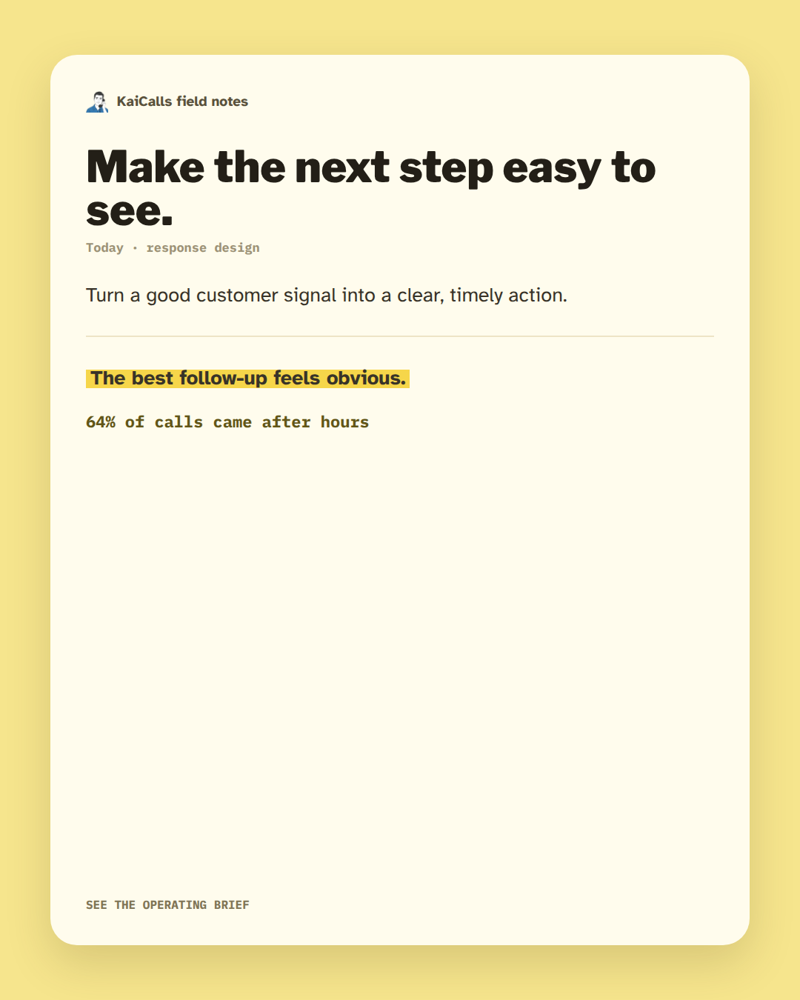 |  | 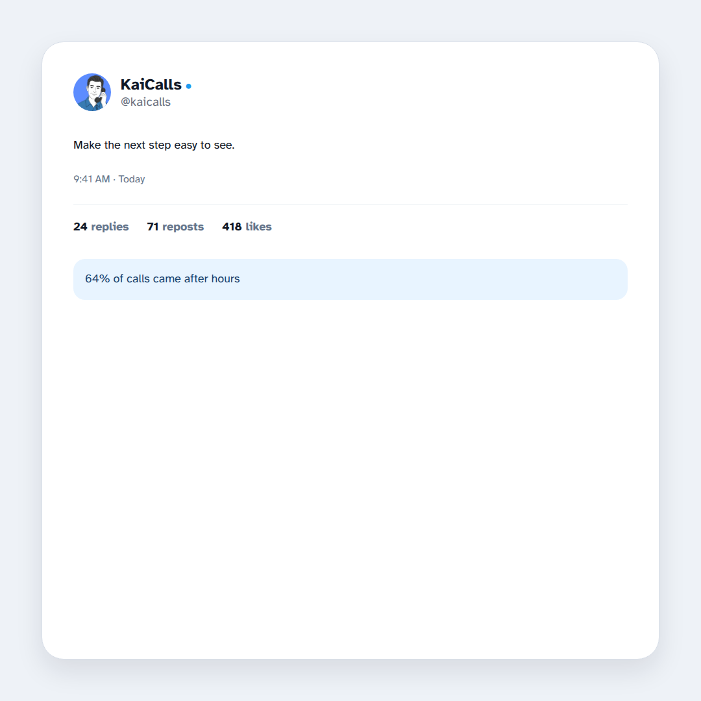 |

| Search/autocomplete | Receipt audit | Operating checklist |
| --- | --- | --- |
| 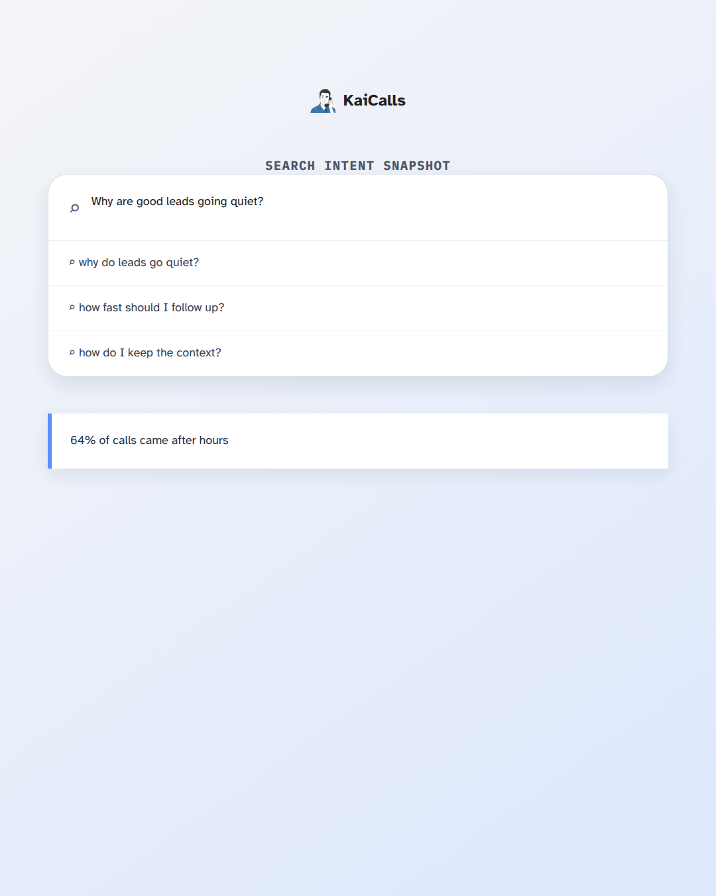 | 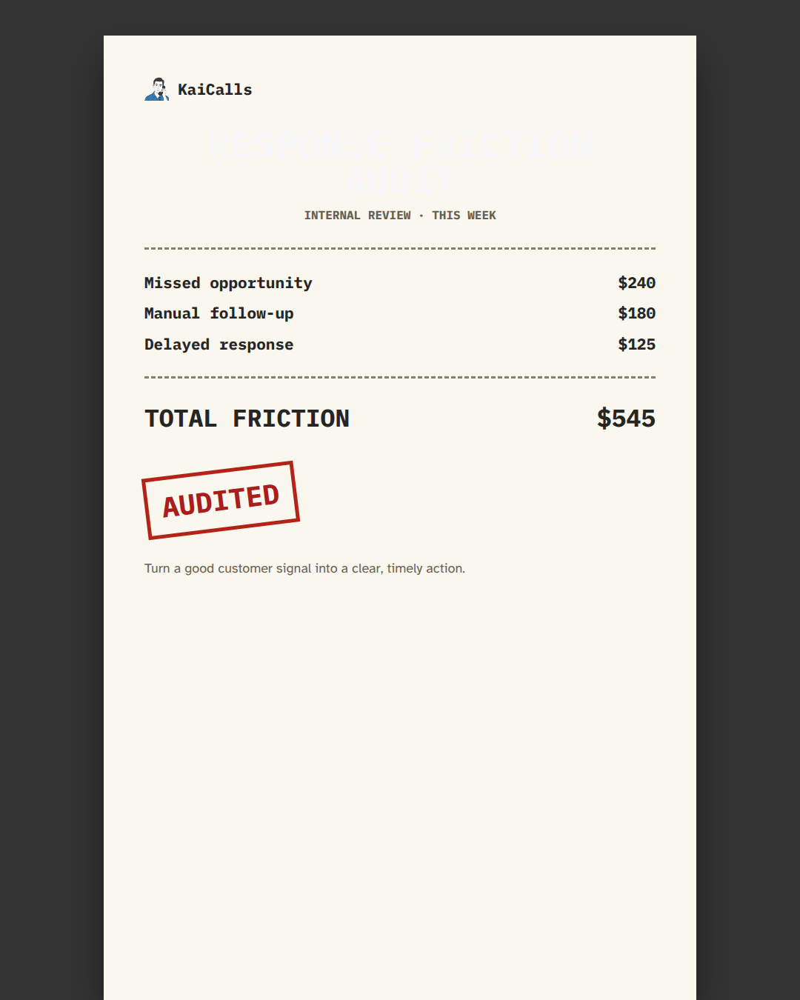 | 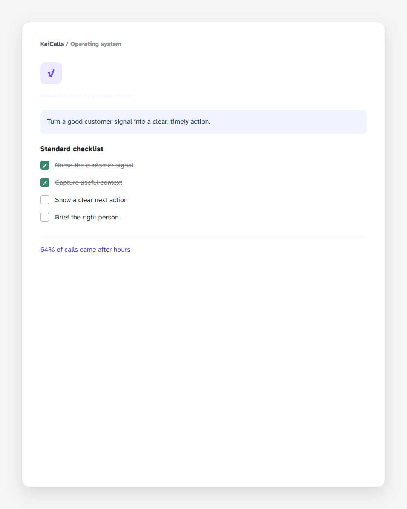 |

## Proof and systems formats

| Whiteboard model | Metrics scorecard | Launch calendar |
| --- | --- | --- |
| 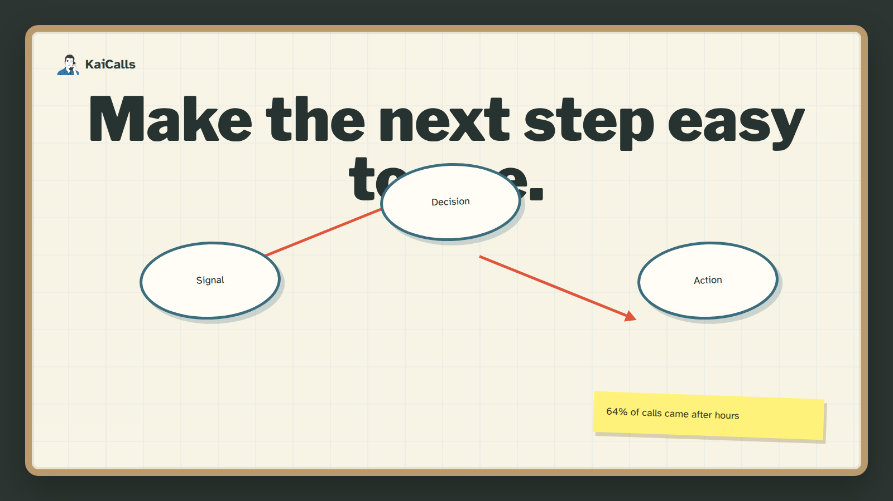 | 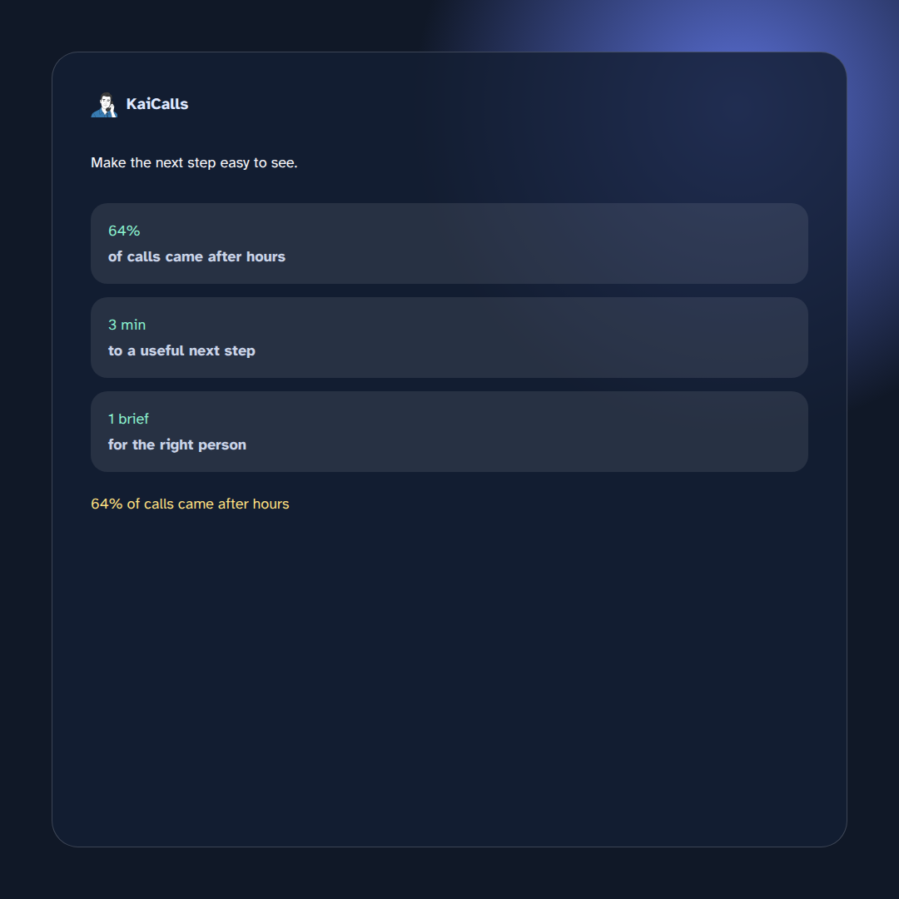 | 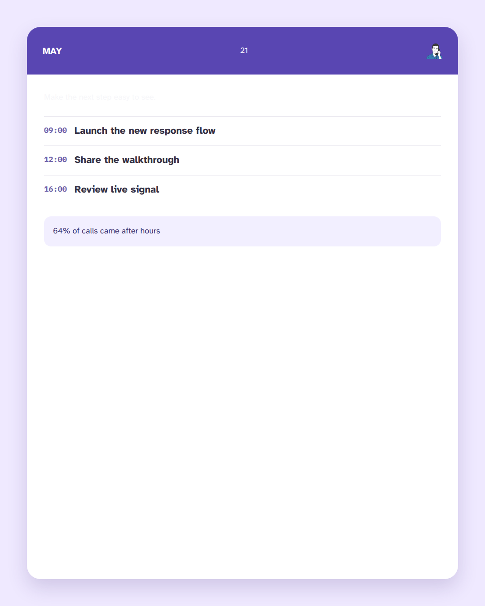 |

| Testimonial quote | Inbox alert | Workflow timeline |
| --- | --- | --- |
| 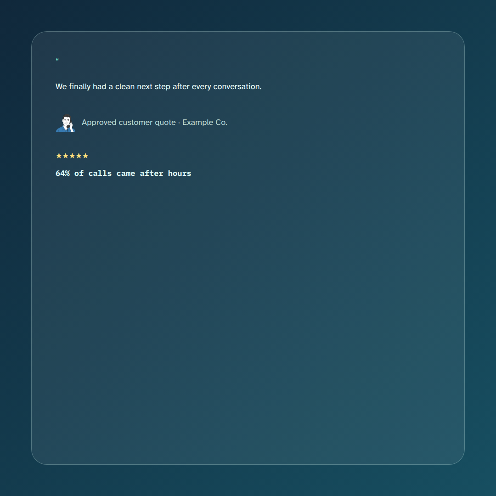 | 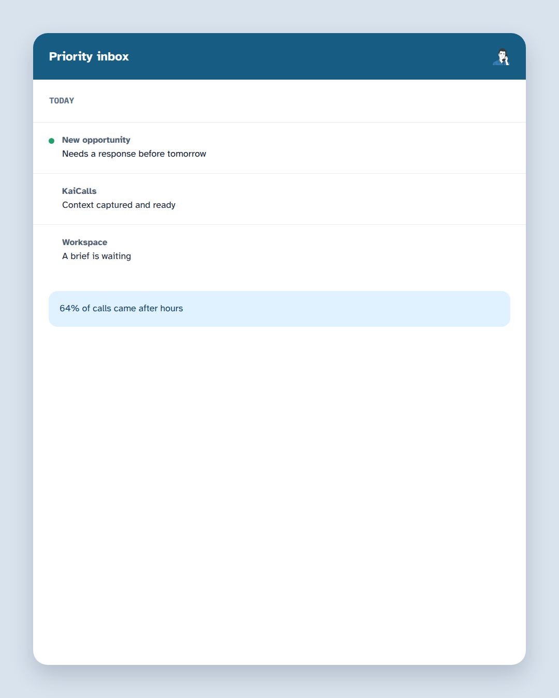 | 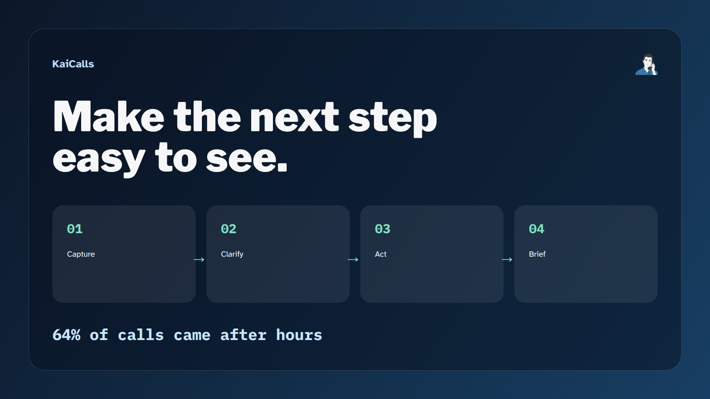 |

Each image has a matching provenance sidecar that identifies its request, template, dimensions, approved brand layers, proof source, and render metadata.
