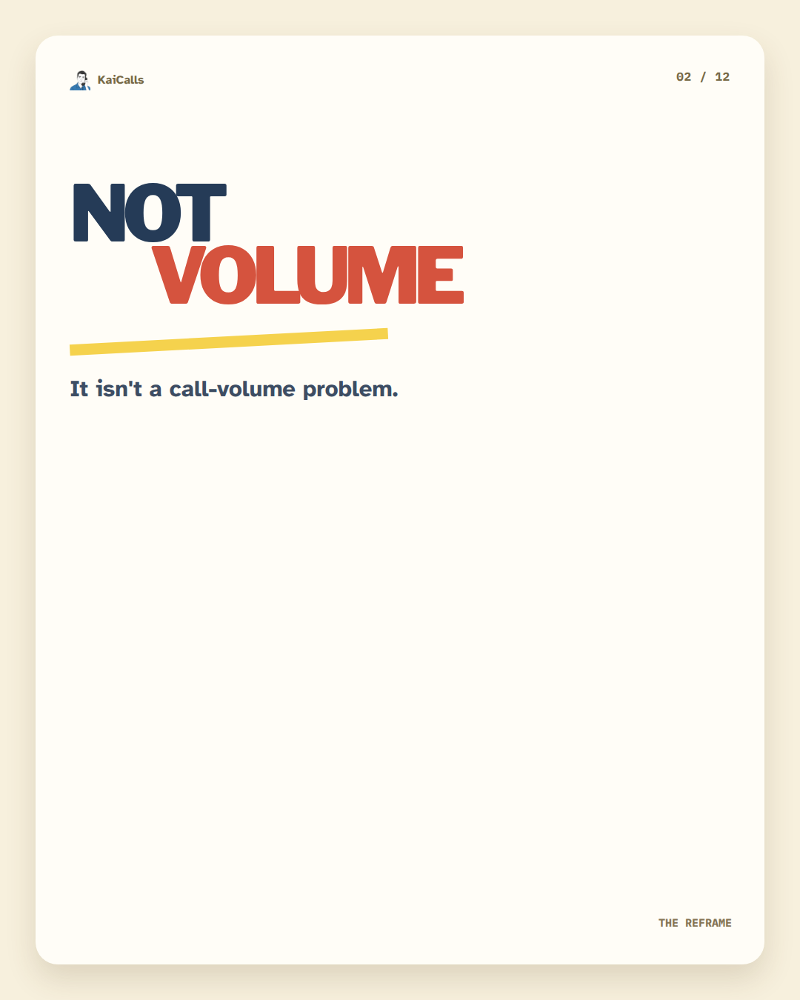
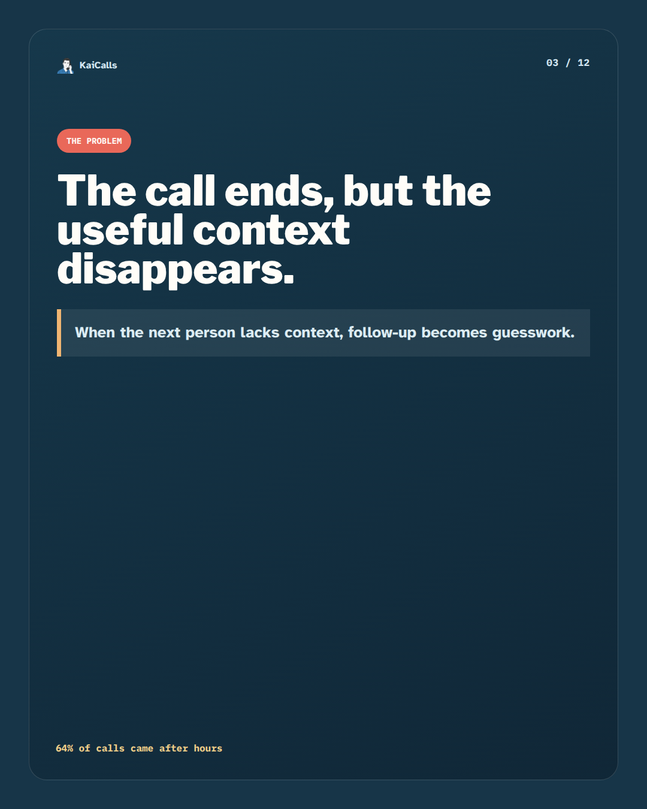
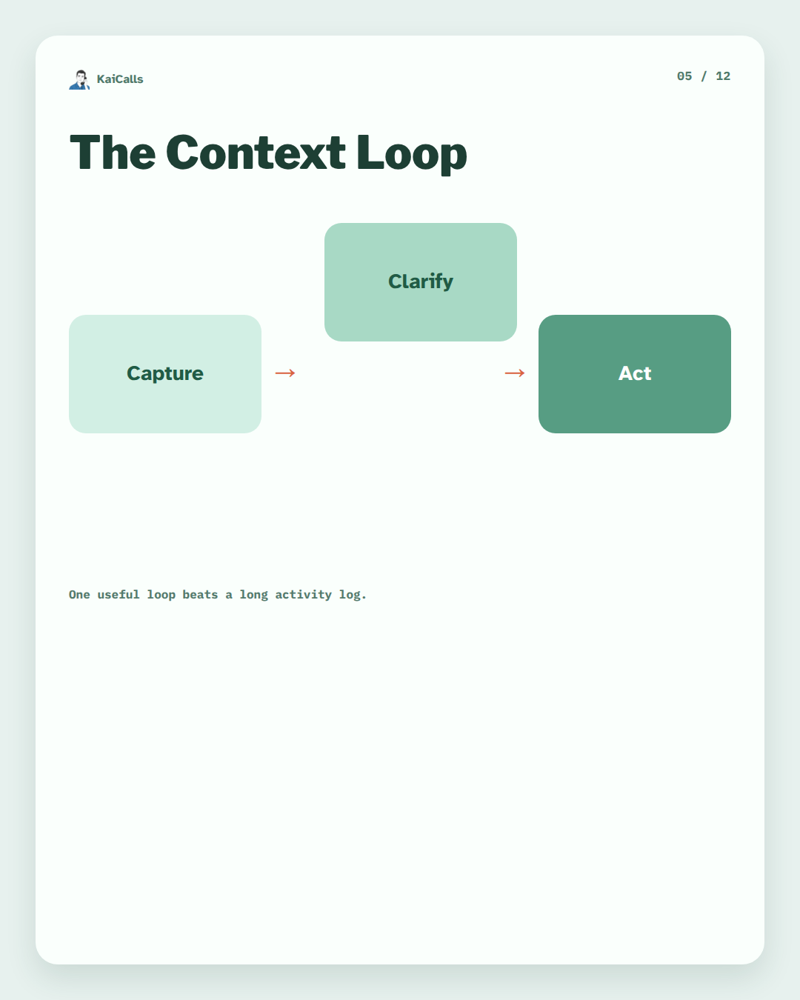
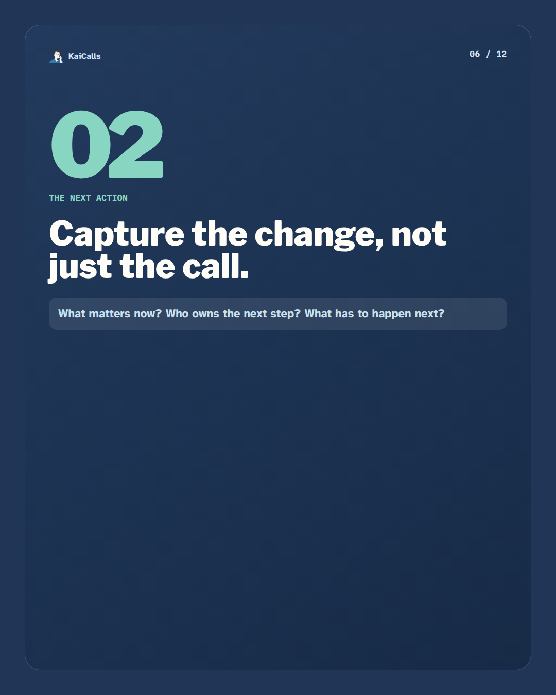
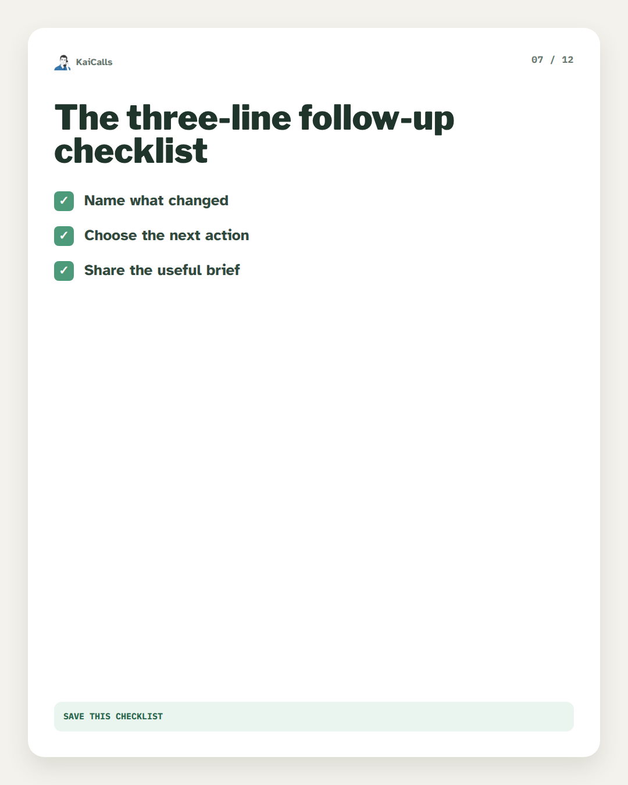
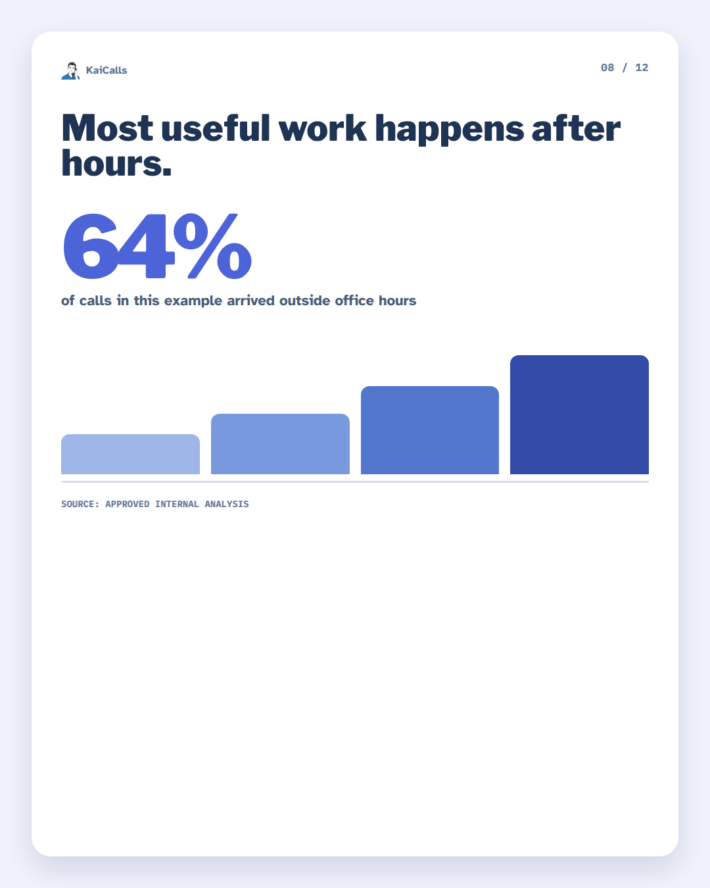
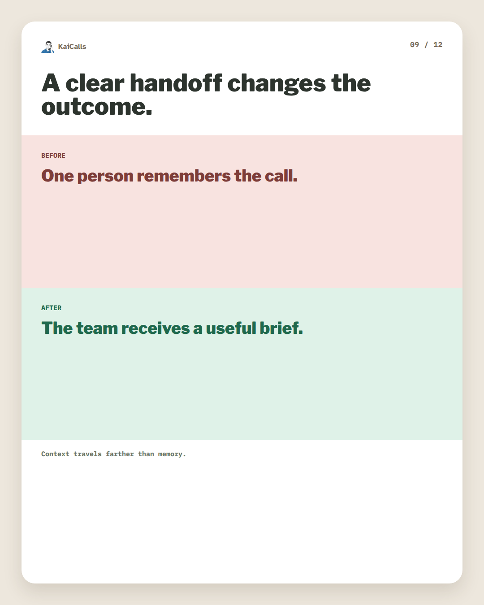
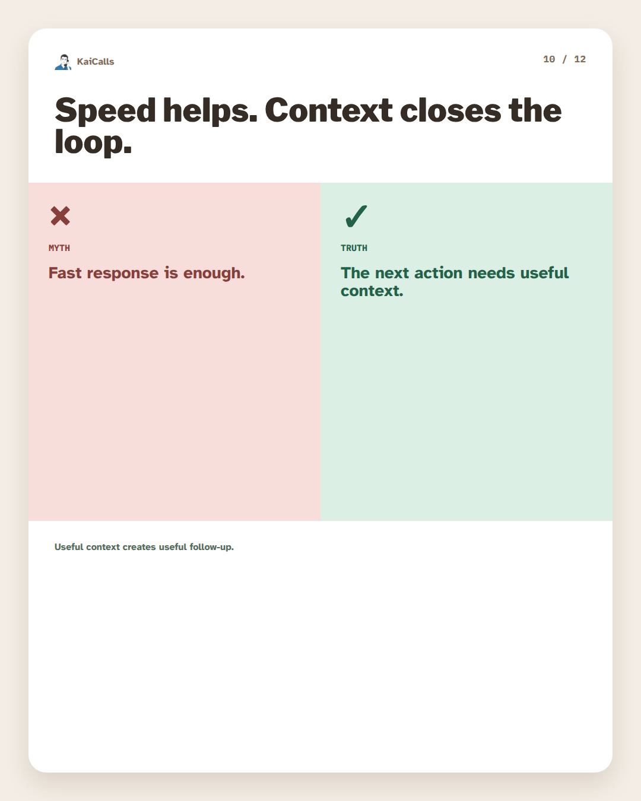
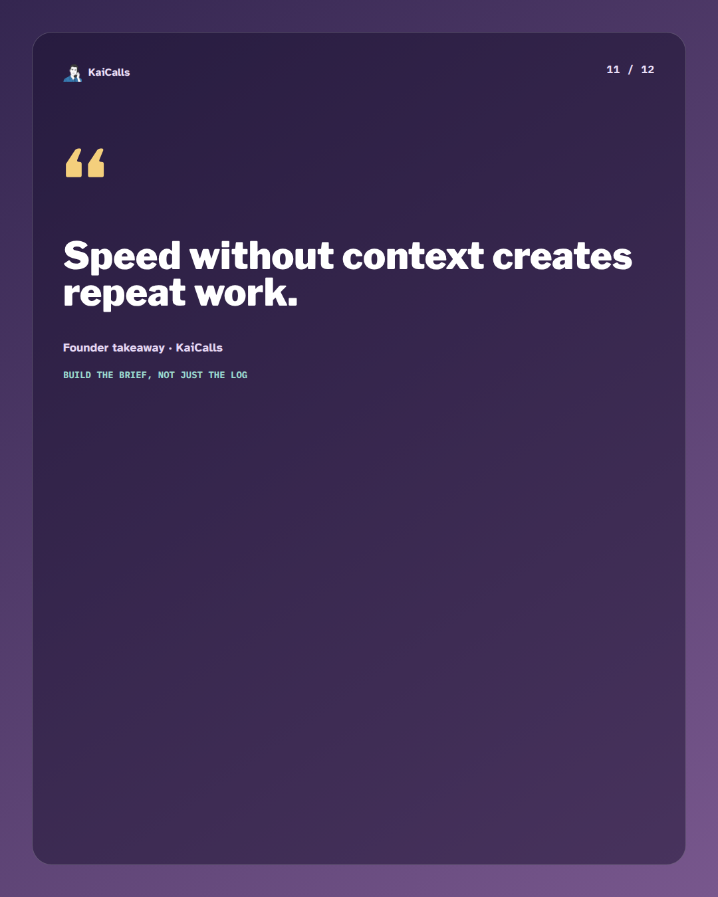
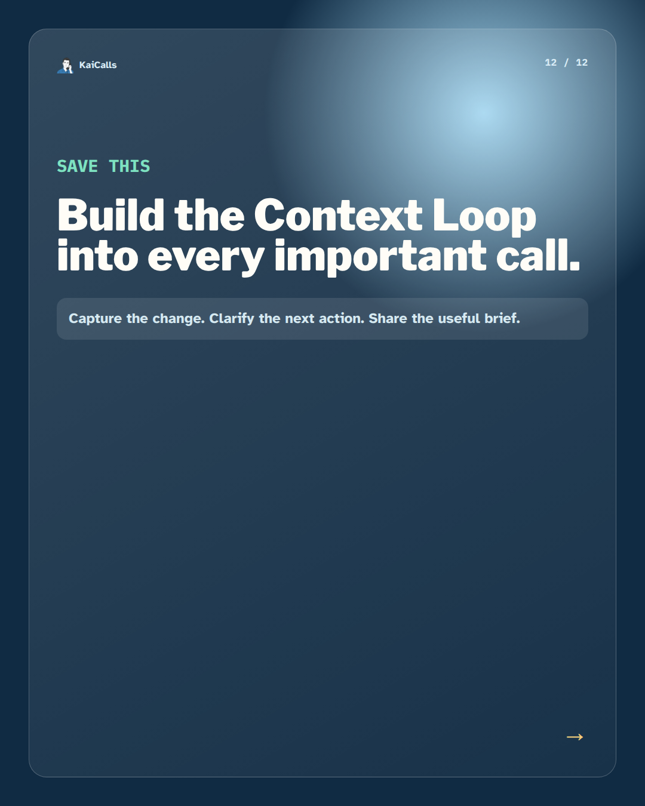

# Context Loop Carousel Example

This directory contains an original twelve-slide, performance-oriented carousel rendered with the Visual Factory Kit. It demonstrates the sequence documented in [`../../VIRAL_CAROUSEL_PLAYBOOK.md`](../../VIRAL_CAROUSEL_PLAYBOOK.md): hook, reframe, problem, mistake, framework, step, checklist, proof, before/after, myth/truth, quote, and a specific closing action.

The deck is generated from [`../viral-carousel-request.json`](../viral-carousel-request.json). Its render-level checks passed; see [`kaicalls-context-loop-qa-report.json`](kaicalls-context-loop-qa-report.json) for dimensions, text-fit, mobile readability, proof-source, alt-text, provenance, and banned-term validation.

> This is an original design system based on high-level carousel patterns, not a copy of any individual creator’s content or visual trade dress. The KaiCalls details are demonstration content only.

## The rendered deck

| 1. Cover hook | 2. Pattern interrupt | 3. Problem card |
| --- | --- | --- |
|  |  |  |

| 4. Mistake card | 5. Framework map | 6. Step card |
| --- | --- | --- |
|  |  |  |

| 7. Saveable checklist | 8. Proof snapshot | 9. Before / after |
| --- | --- | --- |
|  |  |  |

| 10. Myth / truth | 11. Quote takeaway | 12. Closing CTA |
| --- | --- | --- |
|  |  |  |

Every PNG has a matching provenance sidecar with the source request, template, dimensions, brand assets, and proof metadata.
